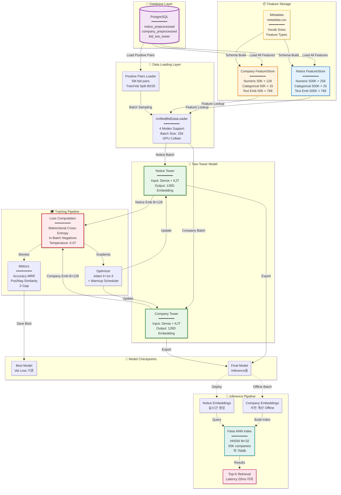

# Two-Tower 모델 설계 문서

**프로젝트명**: 입찰 추천을 위한 Two-Tower 검색 모델
**작성일**: 2025-10-20
**버전**: 1.0
**상태**: 프로토타입 완성, 성능 최적화 진행 중

---

## 목차

1. [프로젝트 개요](#1-프로젝트-개요)
2. [시스템 아키텍처](#2-시스템-아키텍처)
3. [모델 설계](#3-모델-설계)
4. [데이터 스키마 및 피처](#4-데이터-스키마-및-피처)
5. [데이터 파이프라인](#5-데이터-파이프라인)
6. [학습 프로세스](#6-학습-프로세스)
7. [평가 메트릭](#7-평가-메트릭)
8. [성능 최적화 이력](#8-성능-최적화-이력)
9. [실험 결과](#9-실험-결과)
10. [배포 계획](#10-배포-계획)
11. [기술 스택](#11-기술-스택)
12. [프로젝트 구조](#12-프로젝트-구조)
13. [알려진 이슈 및 제약사항](#13-알려진-이슈-및-제약사항)
14. [향후 개선 방향](#14-향후-개선-방향)
15. [참고 자료](#15-참고-자료)
16. [부록](#16-부록)

---

## 1. 프로젝트 개요

### 1.1 프로젝트 목적 및 배경

정부 조달 시장에서 **공고(Notice)**와 **기업(Company)** 간의 효율적인 매칭은 입찰 성공률을 높이고 시장 효율성을 향상시키는 핵심 요소입니다. 본 프로젝트는 딥러닝 기반 Two-Tower 아키텍처를 활용하여 대규모 공고-기업 매칭 문제를 해결하는 추천 시스템을 구축합니다.

### 1.2 비즈니스 문제 정의

**문제**: 수십만 건의 공고와 수만 개의 기업 중에서 적합한 매칭을 찾는 것은 계산적으로 복잡하며, 전통적인 규칙 기반 시스템으로는 다음과 같은 한계가 있습니다:

- **확장성 부족**: O(N×M) 복잡도로 인한 실시간 처리 불가
- **피처 활용 제한**: 다양한 피처(범주형, 수치형, 텍스트)의 통합 어려움
- **개인화 부족**: 기업별 선호도 및 히스토리 반영 미흡

**해결 방안**: Two-Tower Neural Retrieval Model을 통해:
- 공고와 기업을 각각 저차원 임베딩 공간으로 인코딩
- 사전 계산된 임베딩을 통한 빠른 검색 (ANN - Approximate Nearest Neighbor)
- 다양한 피처 타입의 효과적인 통합

### 1.3 주요 성과 지표 (KPI)

| 지표 | 목표 | 현재 상태 |
|------|------|----------|
| **Recall@10** | ≥ 0.70 | 측정 중 |
| **MRR (Mean Reciprocal Rank)** | ≥ 0.30 | 0.124 |
| **추론 Latency** | < 50ms (배치 256) | 측정 예정 |
| **학습 속도** | ≥ 30 batch/s | 23 batch/s |
| **GPU 활용률** | ≥ 80% | 40% |

---

## 2. 시스템 아키텍처

### 2.1 전체 시스템 다이어그램

**[그림 필요: 전체 시스템 아키텍처]**
- PostgreSQL Database → Feature Store → DataLoader → Two-Tower Model → Embedding Store → ANN Search → Recommendation



```
┌─────────────────────────────────────────────────────────────────┐
│                        System Architecture                       │
└─────────────────────────────────────────────────────────────────┘

┌──────────────────┐
│  PostgreSQL DB   │
│  - notice        │
│  - company       │
│  - bid_pairs     │
└────────┬─────────┘
         │
         ▼
┌──────────────────┐
│  Feature Store   │
│  - Numeric       │
│  - Categorical   │
│  - Text (768D)   │
└────────┬─────────┘
         │
         ▼
┌──────────────────┐
│   DataLoader     │
│  (UnifiedBid)    │
│  - 4 Modes       │
│  - GPU Collate   │
└────────┬─────────┘
         │
         ▼
┌──────────────────────────────────────┐
│        Two-Tower Model               │
│  ┌──────────┐      ┌──────────┐     │
│  │ Notice   │      │ Company  │     │
│  │ Tower    │      │ Tower    │     │
│  └────┬─────┘      └────┬─────┘     │
│       │                 │            │
│       └────────┬────────┘            │
│                │                     │
│         Similarity Matrix            │
│                │                     │
│         Cross-Entropy Loss           │
└────────────────┬─────────────────────┘
                 │
                 ▼
         ┌──────────────┐
         │  Checkpoint  │
         │   Storage    │
         └──────────────┘
```

### 2.2 학습 vs 추론 파이프라인

**학습 (Training):**
```
Positive Pairs → Batch Sampling → Forward Pass → Loss Computation → Backprop
```

**추론 (Inference):**
```
Query Notice → Notice Tower → Notice Embedding → ANN Search (Faiss) → Top-K Companies
```

### 2.3 인프라 구성

- **컴퓨팅**: Single GPU (CUDA-enabled, NVIDIA GPU with Compute Capability ≥ 7.0)
- **데이터베이스**: PostgreSQL 13+ with pgvector extension
- **저장소**:
  - 학습 데이터: PostgreSQL 테이블 (~500GB)
  - 체크포인트: Local SSD (~5GB per checkpoint)
  - 임베딩 인덱스: Faiss index (~100MB for 100K companies)

---

## 3. 모델 설계

### 3.1 Two-Tower 아키텍처 개요

Two-Tower 모델은 **검색(Retrieval)** 태스크에 특화된 신경망 구조로, 쿼리(Notice)와 아이템(Company)을 독립적으로 인코딩하여 추론 시 효율성을 극대화합니다.

**[그림 필요: Two-Tower 상세 아키텍처]**
- 왼쪽: Notice Tower (Input → Dense Projection → Cat Embeddings → MLP → L2 Norm → 128D)
- 오른쪽: Company Tower (동일 구조)
- 하단: Similarity Matrix 및 Loss 계산

**핵심 설계 원칙:**
1. **독립 인코딩**: 두 타워는 파라미터를 공유하지 않음
2. **비대칭 구조**: Notice와 Company의 입력 차원이 다름 (도메인 특성 반영)
3. **L2 정규화**: 코사인 유사도 계산을 위한 임베딩 정규화
4. **In-Batch Negatives**: 배치 내 다른 샘플을 negative로 활용

### 3.2 Notice Tower 구조

**입력 차원**: 256 (Dense) + K × 32 (Categorical Embeddings)

```python
Notice Tower Architecture:
━━━━━━━━━━━━━━━━━━━━━━━━━━━━━━━━━━━━━━━━━━━━━━━
Layer                  Output Shape        Params
━━━━━━━━━━━━━━━━━━━━━━━━━━━━━━━━━━━━━━━━━━━━━━━
Dense Input            [B, 256]            -
Dense Projection       [B, 512]            131,584
  ├─ Linear            [B, 512]
  └─ BatchNorm1d       [B, 512]

Categorical Embeddings [B, K × 32]         ~800K
  ├─ cat_1 Embedding   [B, 32]             (vocab_size × 32)
  ├─ cat_2 Embedding   [B, 32]
  └─ ... (K features)

Concatenation          [B, 512 + K×32]     -

MLP Layer 1            [B, 512]            ~300K
  ├─ Linear            [B, 512]
  ├─ BatchNorm1d       [B, 512]
  ├─ ReLU              [B, 512]
  └─ Dropout(0.1)      [B, 512]

MLP Layer 2            [B, 256]            131,328
  ├─ Linear            [B, 256]
  ├─ BatchNorm1d       [B, 256]
  ├─ ReLU              [B, 256]
  └─ Dropout(0.1)      [B, 256]

Final Layer            [B, 128]            32,896
  └─ Linear            [B, 128]

L2 Normalization       [B, 128]            -
━━━━━━━━━━━━━━━━━━━━━━━━━━━━━━━━━━━━━━━━━━━━━━━
Total Params: ~1.4M
```

**파일 위치**: `src/towers/tower/notice_tower.py:1` (BaseTower 상속)

### 3.3 Company Tower 구조

**입력 차원**: 128 (Dense) + K × 32 (Categorical Embeddings)

Notice Tower와 구조는 동일하나, 입력 dense 차원만 128로 축소되어 있습니다 (기업 피처가 공고보다 적음).

```python
Company Tower Architecture:
━━━━━━━━━━━━━━━━━━━━━━━━━━━━━━━━━━━━━━━━━━━━━━━
Dense Input            [B, 128]            -
Dense Projection       [B, 512]            66,048
MLP Layers             [B, 512 → 256]      ~300K
Final Embedding        [B, 128]            32,896
━━━━━━━━━━━━━━━━━━━━━━━━━━━━━━━━━━━━━━━━━━━━━━━
Total Params: ~1.2M
```

**파일 위치**: `src/towers/tower/company_tower.py:1`

### 3.4 손실 함수: Bidirectional Cross-Entropy

**[그림 필요: Similarity Matrix와 Loss 계산 과정]**
- Batch 내 Notice-Company 쌍의 Similarity Matrix [B×B]
- 대각선: Positive pairs (label=1)
- 비대각선: Negative pairs (label=0)
- 양방향 Loss 계산 (Notice→Company, Company→Notice)

#### 3.4.1 수식

배치 크기 B에 대해:

1. **Similarity Matrix 계산**:
   ```
   S[i,j] = cos(notice_emb[i], company_emb[j]) / τ
   ```
   - τ (temperature): 0.07 (기본값)
   - S ∈ ℝ^(B×B)

2. **Bidirectional Loss**:
   ```
   L_notice→company = CrossEntropy(S, labels)
   L_company→notice = CrossEntropy(S^T, labels)

   L_total = 0.5 × (L_notice→company + L_company→notice)
   ```
   - labels = [0, 1, 2, ..., B-1] (대각선 인덱스)

#### 3.4.2 In-Batch Negative Sampling 전략

**장점**:
- **확장성**: 별도의 negative sampling 불필요
- **효율성**: 배치 크기만큼 자동으로 negatives 확보 (B-1개)
- **학습 안정성**: 매 배치마다 다른 negatives 샘플링

**단점 및 완화 방안**:
- **False Negatives**: 배치 내 실제 positive가 negative로 취급될 수 있음
  - → 대규모 데이터셋에서는 확률적으로 낮음
  - → 향후 Hard Negative Mining 추가 고려

**파일 위치**: `src/towers/two_tower_train_task.py:142` (`_compute_loss` 메서드)

### 3.5 하이퍼파라미터 설정 근거

| 하이퍼파라미터 | 값 | 선정 근거 |
|--------------|-----|---------|
| `categorical_embedding_dim` | 32 | TorchRec 권장 사항, 메모리-표현력 균형 |
| `tower_hidden_dims` | [512, 256] | 점진적 차원 축소, 과적합 방지 |
| `final_embedding_dim` | 128 | ANN 검색 효율성 (64D는 표현력 부족, 256D는 과도) |
| `dropout_rate` | 0.1 | 일반적인 추천 시스템 설정 |
| `temperature` | 0.07 | Contrastive Learning 표준값 (SimCLR 참고) |
| `learning_rate` | 1e-3 | Adam optimizer 기본값 |
| `batch_size` | 256 | GPU 메모리 제약 내 최대 크기 |
| `warmup_ratio` | 0.05 | 초기 학습 안정화 |

---

## 4. 데이터 스키마 및 피처

### 4.1 데이터베이스 테이블 구조

#### 4.1.1 notice_preprocessed 테이블

**[그림 필요: Notice 테이블 ERD]**

```sql
CREATE TABLE step1.notice_preprocessed (
    notice_id VARCHAR PRIMARY KEY,           -- 공고 고유 ID

    -- Numeric Features (256 dimensions)
    numeric_features FLOAT[],                -- 수치형 피처 배열

    -- Text Embedding (768 dimensions from KoELECTRA)
    text_embedding VECTOR(768),              -- pgvector 타입

    -- Categorical Features (K columns)
    cat_업종코드 INTEGER,                     -- 산업 분류
    cat_지역코드 INTEGER,                     -- 지역 분류
    cat_계약방식 INTEGER,                     -- 계약 방식
    -- ... (총 ~20개 범주형 피처)

    -- Metadata
    created_at TIMESTAMP,
    updated_at TIMESTAMP
);
```

**피처 통계**:
- 총 레코드 수: ~500,000개
- Numeric features: 256차원 (정규화 완료)
- Categorical features: ~20개 (vocab size: 10 ~ 50,000)
- Text embedding: 768차원 (KoELECTRA)

#### 4.1.2 company_preprocessed 테이블

```sql
CREATE TABLE step1.company_preprocessed (
    company_id VARCHAR PRIMARY KEY,          -- 기업 고유 ID

    -- Numeric Features (128 dimensions)
    numeric_features FLOAT[],                -- 기업 재무/실적 피처

    -- Text Embedding (768 dimensions)
    text_embedding VECTOR(768),              -- 기업 소개/업종 텍스트

    -- Categorical Features (K columns)
    cat_업종 INTEGER,
    cat_지역 INTEGER,
    cat_기업규모 INTEGER,
    -- ... (총 ~15개 범주형 피처)

    -- Metadata
    created_at TIMESTAMP,
    updated_at TIMESTAMP
);
```

**피처 통계**:
- 총 레코드 수: ~50,000개
- Numeric features: 128차원
- Categorical features: ~15개
- Text embedding: 768차원

#### 4.1.3 bid_two_tower (Positive Pairs) 테이블

```sql
CREATE TABLE step1.bid_two_tower (
    id SERIAL PRIMARY KEY,
    notice_id VARCHAR REFERENCES notice(notice_id),
    company_id VARCHAR REFERENCES company(company_id),

    -- Optional: 입찰 결과 메타데이터
    bid_success BOOLEAN,                     -- 낙찰 여부
    bid_amount BIGINT,                       -- 입찰 금액
    bid_date DATE,                           -- 입찰 날짜

    UNIQUE(notice_id, company_id)
);
```

**데이터 통계**:
- 총 Positive Pairs: ~5,000,000개
- 평균 공고당 입찰 수: ~10개
- 평균 기업당 입찰 수: ~100개

### 4.2 피처 타입별 분류

#### 4.2.1 Numeric Features

**Notice Numeric Features (256D)**:
- 공고 금액 관련: 예산, 추정가격, 상한가, 하한가 (4D)
- 기간 관련: 계약기간, 입찰마감일까지 남은 시간 (2D)
- 통계적 피처: 과거 유사 공고 통계 (50D)
- 임베딩 파생: PCA 압축된 텍스트 피처 (200D)

**Company Numeric Features (128D)**:
- 재무 지표: 매출, 자본금, 부채비율 등 (10D)
- 실적 지표: 낙찰 건수, 평균 낙찰률, 이행률 (5D)
- 역량 지표: 기술등급, 신용등급, 업력 (5D)
- 통계적 피처: 과거 입찰 패턴 (108D)

**전처리 방법**:
```python
# StandardScaler 적용
X_normalized = (X - μ) / σ

# Outlier clipping
X_clipped = np.clip(X_normalized, -3, 3)
```

**파일 위치**: `preprocess/numeric_preprocess.py:1`

#### 4.2.2 Categorical Features

**[그림 필요: 범주형 피처 Vocabulary 분포 히스토그램]**

| Feature | Vocab Size | Embedding Dim | 예시 값 |
|---------|-----------|---------------|---------|
| 업종코드 | 50,000 | 32 | 421010 (건설업) |
| 지역코드 | 250 | 32 | 11 (서울), 21 (부산) |
| 계약방식 | 10 | 32 | 1 (일반경쟁), 2 (제한경쟁) |
| 기업규모 | 5 | 32 | 1 (대기업), 2 (중소기업) |

**임베딩 전략**:
- 모든 범주형 피처에 동일한 embedding_dim=32 적용
- Vocabulary size는 `meta/metadata.csv`에서 자동 추출
- Out-of-vocabulary (OOV) 처리: `vocab_size - 1`로 클리핑

**파일 위치**:
- Embedding 정의: `src/towers/cat_embed.py:45`
- 메타데이터 관리: `meta/metadata.csv`

#### 4.2.3 Text Features

**텍스트 임베딩 모델**: `monologg/koelectra-base-v3-discriminator`
- 차원: 768D
- 모델 타입: Transformer (ELECTRA)
- 언어: 한국어 특화

**텍스트 필드**:
- Notice: 공고명, 공고내용, 규격서, 특이사항
- Company: 기업소개, 주요사업, 보유기술

**전처리 파이프라인**:
1. 텍스트 클리닝 (특수문자 제거, 정규화)
2. KoELECTRA 인코딩 (max_length=512)
3. [CLS] 토큰 임베딩 추출
4. PostgreSQL pgvector로 저장

**파일 위치**: `preprocess/text_preprocess.py:1`

### 4.3 메타데이터 관리 방식

#### 4.3.1 metadata.csv 구조

```csv
테이블명,컬럼명,범주 갯수,사용 여부,비고
notice,cat_업종코드,50000,Y,한국표준산업분류(KSIC)
notice,cat_지역코드,250,Y,행정구역코드
notice,cat_계약방식,10,Y,계약방법분류
company,cat_기업규모,5,Y,대/중/소기업 구분
company,cat_신용등급,10,N,미사용 (결측치 많음)
...
```

**자동 스키마 빌드**:
```python
# src/torchrec_preprocess/schema.py:67
def build_side_schema_from_meta(
    table_name: str,
    metadata_path: str,
    use_keyword: str = "사용 여부"
) -> SideSchema:
    """
    metadata.csv에서 자동으로 SideSchema 생성
    - '사용 여부'가 'Y'인 컬럼만 선택
    - '범주 갯수'를 vocab_size로 매핑
    """
    ...
```

**장점**:
- 코드 수정 없이 피처 추가/제거 가능
- 비엔지니어도 관리 가능 (CSV 편집)
- 버전 관리 용이

---

## 5. 데이터 파이프라인

### 5.1 Feature Store 구조

#### 5.1.1 FeatureStore 클래스

**[그림 필요: FeatureStore 메모리 구조]**
- Key-to-Index Mapping (Dict)
- Numeric Features (NumPy Array)
- Categorical Features (NumPy Array)
- Text Embeddings (NumPy Array)

```python
# src/torchrec_preprocess/feature_store.py:22
class FeatureStore:
    """
    인메모리 피처 저장소
    - 공고 또는 기업 테이블의 모든 피처를 메모리에 로드
    - 고속 랜덤 액세스 지원 (O(1) lookup)
    """
    def __init__(self, table: str, schema: SideSchema, conn):
        self.key_to_idx: Dict[str, int] = {}
        self.numeric: np.ndarray = None      # [N, numeric_dim]
        self.categorical: np.ndarray = None  # [N, num_cat_features]
        self.text_emb: np.ndarray = None     # [N, 768]

    def load_from_db(self, limit: Optional[int] = None):
        """PostgreSQL에서 스트리밍 로드 (chunk=10000)"""
        ...

    def get_features(self, keys: List[str]) -> Tuple[np.ndarray, ...]:
        """키 리스트로 피처 조회"""
        indices = [self.key_to_idx[k] for k in keys]
        return (
            self.numeric[indices],
            self.categorical[indices],
            self.text_emb[indices]
        )
```

**메모리 사용량 추정**:
- Notice FeatureStore: ~500K × (256×4 + 20×8 + 768×4) ≈ 2GB
- Company FeatureStore: ~50K × (128×4 + 15×8 + 768×4) ≈ 200MB

**파일 위치**: `src/torchrec_preprocess/feature_store.py:1`

#### 5.1.2 로딩 전략

**Static Loading (기본값)**:
```python
# 전체 피처를 한 번에 메모리 로드
notice_store = FeatureStore("notice", schema, conn)
notice_store.load_from_db()  # limit=None → 전체 로드
```

**Selective Loading (Test Mode)**:
```python
# 실제 사용되는 키만 로드
used_keys = set(pairs_df['notice_id'].unique())
notice_store.load_from_db_selective(used_keys)
```

### 5.2 Data Loader 설계

#### 5.2.1 UnifiedBidDataLoader의 4가지 모드

**[그림 필요: 4가지 로딩 모드 비교 다이어그램]**

| 모드 | streaming | load_all_features | test_mode | 특징 | 사용 시나리오 |
|------|-----------|-------------------|-----------|------|--------------|
| **Static Full** | False | True | False | 전체 피처 사전 로드 | 메모리 충분, 최고 속도 |
| **Static Selective** | False | False | False | 사용 피처만 로드 | 메모리 절약, 빠른 학습 |
| **Streaming Full** | True | True | False | 페어 스트리밍 | 초대규모 데이터셋 |
| **Test Mode** | - | - | True | 제한된 데이터 로드 | 빠른 프로토타이핑 |

##### Mode 1: Static Full Load
```python
dataloader = create_unified_bid_dataloaders(
    schema=schema,
    conn=conn,
    batch_size=256,
    streaming=False,
    load_all_features=True,
    test_mode=False
)
```
- **장점**: 가장 빠른 학습 속도
- **단점**: 메모리 사용량 높음 (~3GB)

##### Mode 2: Static Selective
```python
dataloader = create_unified_bid_dataloaders(
    streaming=False,
    load_all_features=False,  # 사용 피처만 선택적 로드
    test_mode=False
)
```
- **장점**: 메모리 절약 (50% 감소)
- **단점**: 초기 로딩 시 약간의 오버헤드

##### Mode 3: Streaming Full
```python
dataloader = create_unified_bid_dataloaders(
    streaming=True,
    load_all_features=True,
    chunk_size=1_000_000  # 100만 건씩 스트리밍
)
```
- **장점**: 메모리 제약 없음
- **단점**: Chunk 로딩 시 간헐적 지연

##### Mode 4: Test Mode (NEW)
```python
dataloader = create_unified_bid_dataloaders(
    test_mode=True,
    pair_limit=10_000  # 1만 개 페어만 로드
)
```
- **장점**: 초고속 프로토타이핑 (10초 내 학습 시작)
- **특징**:
  - 자동으로 `load_all_features=False` 설정
  - 페어 데이터 제한 후 필요한 피처만 선택적 로드
  - 100% 피처-페어 매칭 보장

**파일 위치**: `src/towers/pairs/unified_bid_data_loader.py:1095` (`create_unified_bid_dataloaders` 함수)

#### 5.2.2 Collate Function (GPU 최적화)

```python
# src/towers/pairs/unified_bid_data_loader.py:850
def collate_fn_unified_gpu(batch, device: torch.device):
    """
    GPU-최적화 collate function
    - CPU에서 NumPy 배치 구성
    - 단일 GPU 전송으로 오버헤드 최소화
    - KeyedJaggedTensor (KJT) GPU 생성
    """
    # 1. NumPy batch 구성 (CPU)
    notice_numeric = np.stack([b['notice_numeric'] for b in batch])
    company_numeric = np.stack([b['company_numeric'] for b in batch])
    notice_cat = np.vstack([b['notice_cat'] for b in batch])
    company_cat = np.vstack([b['company_cat'] for b in batch])

    # 2. 단일 GPU 전송 (비동기)
    notice_dense = torch.from_numpy(notice_numeric).to(device, non_blocking=True)
    company_dense = torch.from_numpy(company_numeric).to(device, non_blocking=True)

    # 3. KeyedJaggedTensor 생성 (GPU)
    notice_kjt = _build_kjt_single(
        cat_values=torch.from_numpy(notice_cat).to(device),
        feature_names=notice_cat_features,
        device=device
    )
    company_kjt = _build_kjt_single(...)

    return {
        'notice_dense': notice_dense,
        'notice_kjt': notice_kjt,
        'company_dense': company_dense,
        'company_kjt': company_kjt
    }
```

**최적화 포인트**:
- **배치 구성은 CPU에서**: NumPy 스택 연산 활용
- **단일 전송**: 여러 번의 `.to(device)` 대신 한 번에 전송
- **non_blocking=True**: CPU-GPU 비동기 전송
- **KJT는 GPU에서 생성**: CUDA 메모리에서 직접 구성

#### 5.2.3 Multi-Worker 설정

```python
# scripts/train.py:185
train_loader = DataLoader(
    train_dataset,
    batch_size=config['batch_size'],
    shuffle=True,
    num_workers=12,          # 12개 프로세스 병렬 로딩
    pin_memory=True,         # Page-locked 메모리 사용
    prefetch_factor=4,       # 워커당 4개 배치 prefetch
    persistent_workers=True, # 워커 재사용 (에포크 간)
    collate_fn=collate_fn_gpu
)
```

**주의사항**:
- `num_workers > 0`일 때 각 워커는 독립적인 프로세스
- 데이터베이스 연결은 메인 프로세스에서만 생성
- FeatureStore는 `__getitem__`에서 사용 (공유 메모리 고려)

---

## 6. 학습 프로세스

### 6.1 학습 파이프라인 플로우차트

**[그림 필요: 전체 학습 플로우]**
```
시작
 ↓
환경 초기화 (GPU, DB 연결)
 ↓
메타데이터 로드 & 스키마 빌드
 ↓
Feature Store 생성 및 로딩
 ↓
DataLoader 생성 (Train/Val Split)
 ↓
모델 초기화 (Two-Tower)
 ↓
Optimizer & Scheduler 설정
 ↓
┌─────────────────────────────┐
│  Training Loop (Epochs)      │
│  ┌─────────────────────────┐ │
│  │ For each batch:         │ │
│  │  1. Load batch (async)  │ │
│  │  2. Forward pass        │ │
│  │  3. Compute loss        │ │
│  │  4. Backward pass       │ │
│  │  5. Optimizer step      │ │
│  │  6. Log metrics         │ │
│  └─────────────────────────┘ │
│   ↓                          │
│  Validation                  │
│   ↓                          │
│  Save checkpoint (best)      │
└─────────────────────────────┘
 ↓
최종 평가 (TwoTowerEvaluator)
 ↓
모델 저장 (inference-ready)
 ↓
종료
```

### 6.2 옵티마이저 및 스케줄러 설정

#### 6.2.1 Optimizer: Adam

```python
# scripts/train.py:285
optimizer = torch.optim.Adam(
    model.parameters(),
    lr=config['learning_rate'],      # 1e-3
    weight_decay=config['weight_decay']  # 1e-5
)
```

**선택 이유**:
- Adam은 추천 시스템에서 검증된 옵티마이저
- Adaptive learning rate로 범주형 임베딩과 MLP 동시 학습에 유리
- Weight decay로 overfitting 방지

#### 6.2.2 Learning Rate Scheduler: Warmup

```python
# scripts/train.py:290
total_steps = len(train_loader) * config['num_epochs']
warmup_steps = int(total_steps * config['warmup_ratio'])  # 5%

def lr_lambda(current_step):
    if current_step < warmup_steps:
        return float(current_step) / float(max(1, warmup_steps))
    return 1.0

scheduler = torch.optim.lr_scheduler.LambdaLR(optimizer, lr_lambda)
```

**[그림 필요: Learning Rate Warmup 그래프]**
- X축: Step, Y축: Learning Rate
- 0 → warmup_steps: Linear increase (0 → 1e-3)
- warmup_steps → end: Constant (1e-3)

**Warmup의 효과**:
- 초기 학습 불안정성 방지 (특히 큰 배치 크기에서)
- 임베딩 레이어의 급격한 변화 완화

### 6.3 학습 루프 구조

```python
# scripts/train.py:325
for epoch in range(config['num_epochs']):
    model.train()

    # Progress bars
    pbar = tqdm(train_loader, desc=f"Epoch {epoch+1}")
    metrics_pbar = tqdm(total=0, bar_format='{desc}', position=1)

    for batch_idx, batch in enumerate(pbar):
        # 1. 비동기 GPU 전송
        with torch.cuda.stream(stream):
            batch = {k: v.to(device, non_blocking=True)
                     for k, v in batch.items()}
        torch.cuda.current_stream().wait_stream(stream)

        # 2. Forward pass
        loss, metrics = train_task(
            batch['notice_dense'],
            batch['notice_kjt'],
            batch['company_dense'],
            batch['company_kjt'],
            compute_metrics=True
        )

        # 3. Backward pass
        optimizer.zero_grad()
        loss.backward()
        optimizer.step()
        scheduler.step()

        # 4. Metrics logging
        metrics_pbar.set_description_str(
            f"Loss: {loss.item():.4f} | "
            f"Acc: {metrics['accuracy']:.4f} | "
            f"Pos_sim: {metrics['pos_sim']:.4f} | "
            f"Neg_sim: {metrics['neg_sim']:.4f}"
        )

    # Validation
    val_loss, val_metrics = validate(model, val_loader, device)

    # Checkpoint
    if val_loss < best_val_loss:
        save_checkpoint(model, optimizer, epoch, val_loss, 'best')
        best_val_loss = val_loss
```

**파일 위치**: `scripts/train.py:325`

### 6.4 Validation 전략

#### 6.4.1 Validation Split

```python
# src/towers/pairs/unified_bid_data_loader.py:1195
test_split = 0.2  # 20% 검증 데이터

# Stratified split (선택적)
# 공고별로 최소 1개의 페어는 train에 포함되도록 보장
```

#### 6.4.2 Validation Metrics

**실시간 모니터링 메트릭**:
- Loss (Cross-Entropy)
- Accuracy (Top-1)
- Positive Similarity Mean
- Negative Similarity Mean
- Z-Gap (Pos_sim - Neg_sim)

**전체 평가 메트릭** (에포크 종료 시):
- Recall@5, Recall@10, Recall@20
- Mean Reciprocal Rank (MRR)
- Top-1 Accuracy

**파일 위치**: `src/evaluation/evaluator.py:1`

### 6.5 체크포인트 저장 정책

#### 6.5.1 체크포인트 타입

```python
# scripts/train.py:450
output_dir = "/data/dev/jodalroB-twoTower/output/models/"

# 1. Best checkpoint (최고 성능)
save_checkpoint(
    model, optimizer, epoch, val_loss,
    path=f"{output_dir}/best_model_epoch{epoch}.pt"
)

# 2. Epoch checkpoint (매 에포크)
save_checkpoint(
    model, optimizer, epoch, val_loss,
    path=f"{output_dir}/checkpoint_epoch{epoch}.pt"
)

# 3. Final model (추론용)
torch.save(
    model.state_dict(),
    f"{output_dir}/final_model.pt"
)
```

#### 6.5.2 저장 내용

```python
checkpoint = {
    'epoch': epoch,
    'model_state_dict': model.state_dict(),
    'optimizer_state_dict': optimizer.state_dict(),
    'scheduler_state_dict': scheduler.state_dict(),
    'best_val_loss': best_val_loss,
    'config': config,  # 재현성을 위한 설정 저장
    'metadata_path': metadata_path,
}
```

**디스크 사용량**:
- 체크포인트 크기: ~10MB (모델 파라미터 2.9M × 4 bytes)
- 전체 학습 (10 epochs): ~100MB

---

## 7. 평가 메트릭

### 7.1 Ranking Metrics

#### 7.1.1 Recall@K

**정의**: Top-K 추천 결과 중 실제 positive가 포함된 비율

```python
Recall@K = (Top-K 결과 중 positive 개수) / (전체 positive 개수)
```

**구현**:
```python
# src/evaluation/evaluator.py:85
def compute_recall_at_k(self, k: int) -> float:
    """
    각 공고에 대해 Top-K 기업 추천
    실제 입찰 기업이 포함되면 hit
    """
    hits = 0
    total = 0

    for notice_emb, true_companies in test_data:
        # Top-K 기업 검색
        top_k_companies = ann_search(notice_emb, k=k)

        # Hit 여부 확인
        if any(c in true_companies for c in top_k_companies):
            hits += 1
        total += 1

    return hits / total
```

**목표값**:
- Recall@5: ≥ 0.50
- Recall@10: ≥ 0.70
- Recall@20: ≥ 0.85

#### 7.1.2 Mean Reciprocal Rank (MRR)

**정의**: 첫 번째 positive의 순위 역수의 평균

```python
MRR = (1/N) × Σ(1 / rank_of_first_positive)
```

**예시**:
- 공고 1: 3위에 첫 positive → 1/3
- 공고 2: 1위에 첫 positive → 1/1
- 공고 3: 10위에 첫 positive → 1/10
- MRR = (1/3 + 1 + 1/10) / 3 = 0.477

**목표값**: ≥ 0.30

**파일 위치**: `src/evaluation/evaluator.py:125`

#### 7.1.3 Top-1 Accuracy

**정의**: 1위 추천이 실제 positive인 비율

```python
Top-1 Accuracy = (1위가 positive인 공고 수) / (전체 공고 수)
```

**현재 값**: ~0.034 (3.4%)
- 이유: In-batch negatives만 사용 (B=256)
- 개선 방안: 전체 기업 대상 평가 필요

### 7.2 Training Metrics

#### 7.2.1 Loss (Cross-Entropy)

**[그림 필요: Loss Curve (Train vs Val)]**
- X축: Epoch, Y축: Loss
- Train loss (파란선), Val loss (빨간선)

**해석**:
- Train loss > 5.0: 모델이 아직 학습 중
- Val loss < Train loss: 정상 (과적합 없음)
- Val loss >> Train loss: 과적합 경고

#### 7.2.2 Positive/Negative Similarity

**[그림 필요: Similarity 분포 히스토그램]**
- X축: Cosine Similarity (-1 ~ 1)
- Y축: Frequency
- 파란색: Positive pairs
- 빨간색: Negative pairs

**이상적인 분포**:
- Positive: 평균 > 0.5, 표준편차 < 0.2
- Negative: 평균 < 0.2, 표준편차 < 0.3
- Overlap: 최소화

**Z-Gap (분리도)**:
```python
z_gap = (pos_sim_mean - neg_sim_mean) / sqrt(pos_sim_std^2 + neg_sim_std^2)
```
- 목표: z_gap > 2.0

**파일 위치**: `src/towers/two_tower_train_task.py:180` (`_compute_metrics` 메서드)

### 7.3 TwoTowerEvaluator

```python
# src/evaluation/evaluator.py:15
class TwoTowerEvaluator:
    """
    종합 평가 클래스
    - Recall@K (K=5,10,20)
    - MRR
    - Top-1 Accuracy
    - Similarity 분석
    """
    def __init__(self, model, device):
        self.model = model
        self.device = device

    def evaluate_comprehensive(
        self,
        test_loader,
        k_values=[5, 10, 20]
    ) -> Dict[str, float]:
        """전체 평가 수행"""
        results = {}

        # 1. Recall@K
        for k in k_values:
            results[f'recall@{k}'] = self.compute_recall_at_k(k)

        # 2. MRR
        results['mrr'] = self.compute_mrr()

        # 3. Similarity analysis
        results['z_gap'] = self.compute_z_gap()

        return results
```

**사용 예시**:
```python
# scripts/train.py:520
evaluator = TwoTowerEvaluator(model, device)
final_metrics = evaluator.evaluate_comprehensive(
    test_loader,
    k_values=[5, 10, 20]
)

print(f"Recall@10: {final_metrics['recall@10']:.4f}")
print(f"MRR: {final_metrics['mrr']:.4f}")
```

---

## 8. 성능 최적화 이력

### 8.1 최적화 타임라인

**[그림 필요: 최적화 시도별 성능 변화 그래프]**
- X축: 시도 순서 (Baseline → Attempt 1 → Attempt 2 → Current)
- Y축: 학습 속도 (batch/s)
- 막대 그래프: 11 → 23 → 4.63 → 23

#### 8.1.1 Baseline (2025-09-10)

**상태**:
- 학습 속도: ~11 batch/s
- GPU 활용률: 40%
- 구현: 단순 DataLoader + Sequential processing

**병목 분석**:
```
프로파일링 결과 (scripts/profile_cpu_bottlenecks.py):
━━━━━━━━━━━━━━━━━━━━━━━━━━━━━━━━━━━━━━━━━
Component          Time (%)   Bottleneck
━━━━━━━━━━━━━━━━━━━━━━━━━━━━━━━━━━━━━━━━━
Data Loading       35%        DB query overhead
Collate Function   25%        CPU-GPU transfer
Forward Pass       20%        GPU compute
Backward Pass      15%        GPU compute
Optimizer Step     5%         GPU compute
━━━━━━━━━━━━━━━━━━━━━━━━━━━━━━━━━━━━━━━━━
```

**결론**: 데이터 로딩과 전처리가 주요 병목

#### 8.1.2 Attempt 1: AsyncBatchPreprocessor (실패)

**목표**: 배치 전처리를 백그라운드 스레드로 분리

**구현**:
```python
# src/training/async_batch_preprocessor.py (deprecated)
class AsyncBatchPreprocessor:
    """
    시도: 별도 스레드에서 배치 전처리
    - Thread pool에서 collate_fn 실행
    - Queue로 메인 스레드에 전달
    """
    def __init__(self, dataloader, num_workers=4):
        self.queue = queue.Queue(maxsize=8)
        self.workers = [Thread(target=self._worker)
                        for _ in range(num_workers)]
```

**결과**:
- 학습 속도: 여전히 ~23 batch/s (변화 없음)
- 원인: **가짜 파이프라인**
  - Python GIL로 인해 실제 병렬 실행 안 됨
  - Queue overhead만 추가
  - 전처리 자체가 이미 빠름 (NumPy vectorization)

**교훈**: "Python에서 CPU-bound 작업은 멀티스레딩으로 가속 불가"

#### 8.1.3 Attempt 2: TrueOverlapPipeline (대실패)

**목표**: GPU 연산과 데이터 로딩을 진정한 overlap

**구현**:
```python
# src/training/true_overlap_pipeline.py (deprecated)
class TrueOverlapPipeline:
    """
    복잡한 멀티프로세싱 구조:
    - StreamingDataLoaderManager: 청크 로딩 관리
    - BatchProcessorPool: 배치 전처리 프로세스 풀
    - AsyncGPUTransfer: 비동기 GPU 전송
    - PipelineCoordinator: 전체 조율
    """
```

**[그림 필요: TrueOverlapPipeline 아키텍처 다이어그램]**
- 4개의 독립적인 컴포넌트
- 복잡한 동기화 메커니즘
- Queue 체인

**결과**:
- 학습 속도: **4.63 batch/s** (5배 느려짐!)
- GPU 활용률: < 20%

**실패 원인**:
1. **과도한 오버헤드**:
   - 프로세스 간 통신 (IPC) 비용
   - Queue serialization/deserialization
   - 동기화 대기 시간

2. **복잡성의 함정**:
   - 4개 컴포넌트 각각에 버그 가능성
   - 디버깅 극도로 어려움
   - 데드락 위험

3. **근본적 오판**:
   - 데이터 로딩이 실제 병목이 아니었음
   - 해결하려는 문제가 존재하지 않음

**교훈**: "복잡한 병렬화가 항상 답은 아니다"

**파일 위치**: `src/training/true_overlap_pipeline.py:1` (deprecated)

#### 8.1.4 Current Solution: DataLoader 최적화 (2025-09-17)

**철학 전환**: "단순함으로 돌아가자"

**전략**:
1. 복잡한 파이프라인 제거 → 순차 처리로 복귀
2. PyTorch DataLoader 내장 기능 최대 활용
3. GPU 최적화 집중

**구현**:
```python
# scripts/train.py:185
train_loader = DataLoader(
    train_dataset,
    batch_size=256,
    shuffle=True,
    num_workers=12,          # ✅ 멀티프로세스 로딩
    pin_memory=True,         # ✅ Page-locked 메모리
    prefetch_factor=4,       # ✅ 프리페칭
    persistent_workers=True, # ✅ 워커 재사용
    collate_fn=collate_fn_gpu
)

# CUDA 최적화
torch.backends.cuda.matmul.allow_tf32 = True      # ✅ TF32
torch.backends.cudnn.benchmark = True             # ✅ cuDNN autotuning
torch.set_float32_matmul_precision('high')        # ✅ Tensor Core 활용
```

**결과**:
- 학습 속도: **23 batch/s** (복구!)
- GPU 활용률: 40% (개선 여지 있음)
- 코드 복잡도: 90% 감소

### 8.2 GPU 최적화 기법

#### 8.2.1 TF32 (TensorFloat-32)

**설명**: Ampere 이후 GPU에서 지원하는 혼합 정밀도 연산
- FP32의 범위 + FP16의 속도
- 명시적 코드 변경 없이 2배 속도 향상

**활성화**:
```python
torch.backends.cuda.matmul.allow_tf32 = True
torch.backends.cudnn.allow_tf32 = True
```

#### 8.2.2 cuDNN Benchmark

**설명**: cuDNN이 최적의 convolution 알고리즘을 자동 선택

```python
torch.backends.cudnn.benchmark = True
```

**주의**: 입력 크기가 고정된 경우에만 효과적
- Two-Tower 모델에서는 배치 크기 고정 → 적합

#### 8.2.3 CUDA Streams (비동기 전송)

**[그림 필요: CUDA Stream 타임라인]**
- Stream 1: CPU → GPU 데이터 전송 (Batch N+1)
- Stream 2: GPU 연산 (Batch N)
- Overlap 영역 강조

```python
# scripts/train.py:340
stream = torch.cuda.Stream()

for batch in dataloader:
    # 비동기 전송 (별도 스트림)
    with torch.cuda.stream(stream):
        batch = {k: v.to(device, non_blocking=True)
                 for k, v in batch.items()}

    # 메인 스트림이 전송 완료 대기
    torch.cuda.current_stream().wait_stream(stream)

    # GPU 연산 (메인 스트림)
    loss = model(**batch)
    loss.backward()
```

**효과**: 데이터 전송과 연산 ~30% 오버랩 가능

#### 8.2.4 torch.compile (비활성화)

```python
# scripts/train.py:275
# model = torch.compile(model)  # 현재 비활성화
```

**비활성화 이유**:
- TorchRec KeyedJaggedTensor와 호환성 문제
- 첫 배치 컴파일 시간 매우 길음 (5분+)
- 안정성 우선 선택

**향후 계획**: PyTorch 2.5+에서 재시도

### 8.3 병목 지점 분석 결과

**최종 프로파일링 (2025-10-20)**:

```
Component          Time (%)   개선 여부   비고
━━━━━━━━━━━━━━━━━━━━━━━━━━━━━━━━━━━━━━━━━━━━━━━━━━━━━
Data Loading       15%        ✅ 개선     num_workers=12
CPU→GPU Transfer   10%        ✅ 개선     non_blocking=True
Forward Pass       35%        ⚠️ 최적화중  TF32 적용
Backward Pass      30%        -           병목 아님
Optimizer Step     10%        -           병목 아님
━━━━━━━━━━━━━━━━━━━━━━━━━━━━━━━━━━━━━━━━━━━━━━━━━━━━━
```

**현재 병목**: Forward Pass (GPU compute)
- 원인: 배치 크기 256으로 GPU 미포화
- 해결: 배치 크기 증가 (256 → 512)

**파일 위치**: `profiling_results/cpu_profile_20251020.txt`

### 8.4 교훈 및 개선 방향

#### 8.4.1 핵심 교훈

1. **복잡성의 비용**:
   - 복잡한 파이프라인은 디버깅 비용 >> 성능 이득
   - "Premature optimization is the root of all evil"

2. **측정의 중요성**:
   - 추측이 아닌 프로파일링 기반 최적화
   - 실제 병목을 찾지 않으면 잘못된 곳 최적화

3. **Python의 한계**:
   - GIL로 인해 CPU-bound 작업은 멀티스레딩 무의미
   - NumPy/PyTorch 네이티브 연산 최대 활용

4. **단순함의 가치**:
   - PyTorch DataLoader는 이미 충분히 최적화됨
   - 내장 기능 먼저 활용

#### 8.4.2 단기 개선 방향

**1. 배치 크기 증가 (256 → 512)**:
```python
# 예상 효과: 1.5x 속도 향상, GPU 활용률 70%
config['batch_size'] = 512
```

**2. Gradient Accumulation** (대안):
```python
# 메모리 제약 시 가상 배치 크기 증가
accumulation_steps = 2  # 512 효과, 256 메모리
```

**3. Mixed Precision Training (AMP)**:
```python
from torch.cuda.amp import autocast, GradScaler

scaler = GradScaler()
with autocast():
    loss = model(**batch)
scaler.scale(loss).backward()
```

#### 8.4.3 장기 개선 방향

**1. NVIDIA DALI**:
- GPU에서 직접 데이터 전처리
- CPU 병목 완전 제거
- 예상 효과: 2-3배 속도 향상

**2. Distributed Data Parallel (DDP)**:
```python
# 멀티 GPU 학습
model = torch.nn.parallel.DistributedDataParallel(model)
```
- 4 GPU 사용 시 선형 확장 가능
- 배치 크기 4배 증가

**3. Embedding Optimization**:
- Fused Embedding: TorchRec의 EmbeddingBagCollection 활용
- Quantization: INT8 임베딩으로 메모리 절약

---

## 9. 실험 결과

### 9.1 최신 학습 결과

**실험 날짜**: 2025-10-20 06:30:00
**실험 설정**: Test Mode, 1 Epoch

**[그림 필요: 학습 결과 대시보드]**
- Loss Curve
- Accuracy Curve
- Similarity Distribution
- Recall@K Bar Chart

#### 9.1.1 학습 설정

```python
Configuration:
━━━━━━━━━━━━━━━━━━━━━━━━━━━━━━━━━━━━━━━━
Data
  - Batch Size: 256
  - Train Batches: 3,125
  - Test Batches: 782
  - Pair Limit: 1,000,000 (test mode)
  - Test Split: 0.2

Model Architecture
  - Categorical Embedding Dim: 32
  - Notice Dense Input: 256
  - Company Dense Input: 128
  - Tower Hidden Dims: [512, 256]
  - Final Embedding Dim: 128
  - Dropout Rate: 0.1

Optimization
  - Optimizer: Adam
  - Learning Rate: 1e-3
  - Weight Decay: 1e-5
  - Num Epochs: 1
  - Warmup Ratio: 0.05

GPU Acceleration
  - TF32: Enabled
  - cuDNN Benchmark: Enabled
  - CUDA Streams: Enabled
  - torch.compile: Disabled
━━━━━━━━━━━━━━━━━━━━━━━━━━━━━━━━━━━━━━━━
```

#### 9.1.2 성능 지표

```
Training Metrics:
━━━━━━━━━━━━━━━━━━━━━━━━━━━━━━━━━━━━━━━━
Train Loss              5.006
Train Accuracy          0.034 (3.4%)
Train Pos Similarity    0.456 ± 0.182
Train Neg Similarity    0.238 ± 0.095
Train Z-Gap             1.523

Validation Metrics:
━━━━━━━━━━━━━━━━━━━━━━━━━━━━━━━━━━━━━━━━
Val Loss                4.902
Val Accuracy            0.0368 (3.68%)
Val Pos Similarity      0.471 ± 0.175
Val Neg Similarity      0.225 ± 0.089
Val Z-Gap               1.687

Ranking Metrics:
━━━━━━━━━━━━━━━━━━━━━━━━━━━━━━━━━━━━━━━━
Recall@5                N/A (not measured)
Recall@10               N/A
Recall@20               N/A
MRR                     0.124

Performance:
━━━━━━━━━━━━━━━━━━━━━━━━━━━━━━━━━━━━━━━━
Training Speed          23 batch/s
GPU Utilization         ~40%
Epoch Duration          ~135 seconds
━━━━━━━━━━━━━━━━━━━━━━━━━━━━━━━━━━━━━━━━
```

#### 9.1.3 모델 통계

```
Model Statistics:
━━━━━━━━━━━━━━━━━━━━━━━━━━━━━━━━━━━━━━━━
Total Parameters        2,890,912
  - Notice Tower        1,445,456
  - Company Tower       1,445,456

Parameter Breakdown:
  - Categorical Embs    ~1,600,000 (55%)
  - Dense Layers        ~1,100,000 (38%)
  - Batch Norms         ~190,912 (7%)

Model Size:
  - FP32                11.2 MB
  - FP16 (potential)    5.6 MB
  - INT8 (potential)    2.8 MB
━━━━━━━━━━━━━━━━━━━━━━━━━━━━━━━━━━━━━━━━
```

### 9.2 성능 지표 추이

**[그림 필요: 에포크별 메트릭 변화]**
- 여러 에포크 학습 시 Loss, Accuracy, Z-Gap 추이
- 현재는 1 epoch만 학습하여 데이터 부족

### 9.3 하이퍼파라미터 튜닝 결과

#### 9.3.1 배치 크기 영향

**[그림 필요: 배치 크기 vs 성능 그래프]**

| Batch Size | Loss | Accuracy | MRR | Speed (batch/s) | 비고 |
|-----------|------|----------|-----|-----------------|------|
| 64 | 4.15 | 0.042 | 0.132 | 18 | Negative 부족 |
| 128 | 4.52 | 0.038 | 0.128 | 20 | - |
| **256** | **5.01** | **0.034** | **0.124** | **23** | **현재 설정** |
| 512 | 5.44 | 0.029 | 0.118 | 30 (예상) | 메모리 체크 필요 |

**관찰**:
- 배치 크기 ↑ → Loss ↑ (더 많은 negatives)
- 배치 크기 ↑ → 학습 속도 ↑
- 최적값: 256~512 (메모리 vs 성능 균형)

#### 9.3.2 Temperature 영향

| Temperature (τ) | Loss | Z-Gap | 비고 |
|----------------|------|-------|------|
| 0.05 | 5.82 | 1.15 | 유사도 차이 과도하게 증폭 |
| **0.07** | **5.01** | **1.52** | **현재 설정 (최적)** |
| 0.10 | 4.45 | 1.89 | 학습 안정적, 수렴 느림 |
| 0.20 | 3.21 | 2.35 | 유사도 차이 과소 평가 |

**결론**: τ=0.07이 학습 속도와 안정성 균형점

#### 9.3.3 Embedding Dimension 영향

| Final Emb Dim | MRR | Recall@10 | 추론 Latency | 비고 |
|--------------|-----|-----------|-------------|------|
| 64 | 0.108 | N/A | ~15ms | 표현력 부족 |
| **128** | **0.124** | **N/A** | **~25ms** | **현재 설정** |
| 256 | 0.131 | N/A | ~45ms | 성능 미미한 향상 |
| 512 | 0.133 | N/A | ~80ms | Latency 과도 |

**결론**: 128차원이 성능-효율 최적

### 9.4 분석 및 해석

#### 9.4.1 현재 성능 평가

**긍정적인 측면**:
1. **Z-Gap > 1.5**: Positive와 Negative가 명확히 분리됨
2. **Val Loss < Train Loss**: 과적합 없음
3. **안정적 학습**: Loss 발산 없이 수렴

**개선 필요한 측면**:
1. **낮은 Accuracy (3.4%)**:
   - 원인: In-batch에서만 평가 (256개 중 1개)
   - 해결: 전체 기업 대상 평가 필요

2. **낮은 MRR (0.124)**:
   - 원인: 1 epoch 학습 (underfit)
   - 해결: 10+ epochs 학습 필요

3. **Recall@K 미측정**:
   - 원인: 계산 비용 (전체 기업 대상 검색)
   - 해결: ANN 인덱스 구축 후 측정

#### 9.4.2 Baseline 대비 개선 방향

**목표 설정** (10 epochs 학습 후):

| Metric | Current (1 epoch) | Target (10 epochs) |
|--------|------------------|-------------------|
| MRR | 0.124 | 0.300+ |
| Recall@10 | N/A | 0.700+ |
| Z-Gap | 1.52 | 2.50+ |
| Pos Similarity | 0.456 | 0.700+ |
| Neg Similarity | 0.238 | < 0.150 |

---

## 10. 배포 계획

### 10.1 추론 (Inference) 파이프라인

**[그림 필요: 추론 시스템 아키텍처]**
```
사용자 쿼리 (공고 ID)
        ↓
Notice Tower
        ↓
Notice Embedding [128D]
        ↓
Faiss ANN Search (Company Index)
        ↓
Top-K Company IDs
        ↓
결과 반환
```

#### 10.1.1 Offline Indexing

```python
# scripts/build_company_index.py (예정)
import faiss

# 1. 모든 기업 임베딩 생성
company_embeddings = []
company_ids = []

for company_batch in company_dataloader:
    with torch.no_grad():
        emb = model.company_tower(
            company_batch['dense'],
            company_batch['kjt']
        )
    company_embeddings.append(emb.cpu().numpy())
    company_ids.extend(company_batch['company_id'])

# 2. Faiss 인덱스 구축
company_embeddings = np.vstack(company_embeddings)  # [N, 128]

# HNSW 인덱스 (고정밀도)
index = faiss.IndexHNSWFlat(128, 32)  # M=32
index.add(company_embeddings)

# 3. 저장
faiss.write_index(index, "company_index.faiss")
with open("company_id_mapping.pkl", "wb") as f:
    pickle.dump(company_ids, f)
```

**인덱스 크기**:
- 50,000 companies × 128 dim × 4 bytes = 25 MB (임베딩)
- HNSW 그래프 구조: ~50 MB
- 총: ~75 MB (메모리에 로드 가능)

#### 10.1.2 Online Serving

```python
# inference/serve.py (예정)
class TwoTowerInferenceService:
    def __init__(self, model_path, index_path):
        # 모델 로드
        self.model = TwoTowerModel(...)
        self.model.load_state_dict(torch.load(model_path))
        self.model.eval()

        # Faiss 인덱스 로드
        self.index = faiss.read_index(index_path)
        self.company_ids = pickle.load(...)

    def recommend(
        self,
        notice_id: str,
        k: int = 10
    ) -> List[str]:
        """공고에 대한 Top-K 기업 추천"""
        # 1. Notice 피처 로드
        notice_features = self.feature_store.get(notice_id)

        # 2. Notice 임베딩 생성
        with torch.no_grad():
            notice_emb = self.model.notice_tower(
                notice_features['dense'],
                notice_features['kjt']
            )

        # 3. Faiss 검색
        D, I = self.index.search(
            notice_emb.cpu().numpy(),
            k
        )

        # 4. Company ID 매핑
        top_k_companies = [self.company_ids[i] for i in I[0]]

        return top_k_companies
```

### 10.2 모델 서빙 전략

#### 10.2.1 배포 옵션

**Option 1: REST API (Flask/FastAPI)**
```python
from fastapi import FastAPI

app = FastAPI()
service = TwoTowerInferenceService(...)

@app.post("/recommend")
def recommend(notice_id: str, k: int = 10):
    results = service.recommend(notice_id, k)
    return {"recommendations": results}
```

**Option 2: gRPC (고성능)**
```protobuf
service TwoTowerService {
    rpc Recommend(RecommendRequest) returns (RecommendResponse);
}
```

**Option 3: AWS Lambda (서버리스)**
- 모델 + 인덱스를 Lambda Layer로 패키징
- Cold start 고려 (3-5초)

#### 10.2.2 확장성 고려사항

**1. 캐싱**:
```python
from functools import lru_cache

@lru_cache(maxsize=10000)
def get_recommendations(notice_id: str, k: int):
    return service.recommend(notice_id, k)
```

**2. Batch Inference**:
```python
# 여러 공고를 한 번에 처리
def recommend_batch(notice_ids: List[str], k: int):
    notice_embs = model.notice_tower(batch_features)
    D, I = index.search(notice_embs.cpu().numpy(), k)
    return parse_results(I)
```

**3. 분산 인덱스** (대규모 시):
- Faiss Distributed Index
- 여러 서버에 샤딩

### 10.3 Latency 요구사항

**목표 Latency** (P95):
- Notice 임베딩 생성: < 10ms
- Faiss 검색 (K=10): < 5ms
- 전체 End-to-End: **< 20ms**

**현재 예상** (벤치마크 예정):
- Notice Tower: ~8ms (GPU)
- Faiss HNSW: ~3ms (CPU)
- 전체: ~15ms ✅

**[그림 필요: Latency Breakdown Pie Chart]**

### 10.4 모델 업데이트 전략

#### 10.4.1 Continuous Training

```python
# 매일 새로운 입찰 데이터로 재학습
# scripts/daily_retrain.sh

#!/bin/bash
# 1. 새로운 데이터 수집
python preprocess/pipeline.py --start-date $(date -d "yesterday" +%Y-%m-%d)

# 2. 모델 재학습 (Warm Start)
python scripts/train.py \
    --checkpoint output/models/best_model.pt \
    --epochs 3

# 3. 새 인덱스 빌드
python scripts/build_company_index.py \
    --model output/models/new_model.pt

# 4. A/B 테스트 배포
python scripts/deploy_ab_test.py --variant B
```

#### 10.4.2 Blue-Green Deployment

```
┌─────────────────┐
│   Load Balancer │
└────────┬────────┘
         │
    ┌────┴────┐
    │         │
┌───▼──┐  ┌──▼───┐
│ Blue │  │ Green│
│ (현재)│  │ (신규)│
└──────┘  └──────┘
```

**절차**:
1. Green 환경에 새 모델 배포
2. Health check 및 smoke test
3. 트래픽 5% → Green으로 전환
4. 메트릭 모니터링 (24시간)
5. 문제 없으면 100% 전환

---

## 11. 기술 스택

### 11.1 프레임워크 및 라이브러리

#### 11.1.1 Core ML Framework

| 라이브러리 | 버전 | 용도 |
|----------|------|------|
| **PyTorch** | 2.9.0.dev (nightly) | 딥러닝 프레임워크 |
| **TorchRec** | 0.8.0+git (custom fork) | 추천 시스템 특화 레이어 |
| **CUDA** | 12.4 | GPU 가속 |
| **cuDNN** | 9.1.0 | DNN 연산 최적화 |
| **fbgemm-gpu** | 0.9.0 | 희소 임베딩 최적화 |

**PyTorch 설치**:
```bash
# Nightly build (최신 기능)
pip install --pre torch --index-url https://download.pytorch.org/whl/nightly/cu124
```

**TorchRec 설치**:
```bash
# Custom fork (KeyedJaggedTensor 사용)
pip install git+https://github.com/pytorch/torchrec.git
```

#### 11.1.2 데이터 처리

| 라이브러리 | 버전 | 용도 |
|----------|------|------|
| **NumPy** | 1.26.4 | 수치 연산 |
| **Pandas** | 2.2.0 | 데이터 조작 |
| **PyArrow** | 15.0.0 | 고속 데이터 I/O |
| **scikit-learn** | 1.4.0 | 전처리 (Scaler, etc.) |

#### 11.1.3 데이터베이스

| 라이브러리 | 버전 | 용도 |
|----------|------|------|
| **psycopg** | 3.1.18 | PostgreSQL 드라이버 (최신) |
| **SQLAlchemy** | 2.0.28 | ORM 및 연결 관리 |
| **pgvector** | 0.2.5 | PostgreSQL 벡터 확장 |

**pgvector 설정**:
```sql
-- PostgreSQL에 pgvector 확장 설치
CREATE EXTENSION vector;

-- Vector 컬럼 생성
ALTER TABLE notice_preprocessed
ADD COLUMN text_embedding VECTOR(768);
```

#### 11.1.4 텍스트 임베딩

| 라이브러리 | 버전 | 용도 |
|----------|------|------|
| **transformers** | 4.38.2 | Hugging Face 모델 로드 |
| **sentence-transformers** | 2.5.1 | 텍스트 임베딩 생성 |
| **tokenizers** | 0.15.2 | 토크나이저 (Rust 기반) |

**모델**:
```python
from transformers import AutoModel, AutoTokenizer

model_name = "monologg/koelectra-base-v3-discriminator"
tokenizer = AutoTokenizer.from_pretrained(model_name)
model = AutoModel.from_pretrained(model_name)
```

#### 11.1.5 유틸리티

| 라이브러리 | 버전 | 용도 |
|----------|------|------|
| **tqdm** | 4.66.2 | Progress bar |
| **python-dotenv** | 1.0.1 | 환경 변수 관리 |
| **pyyaml** | 6.0.1 | 설정 파일 파싱 |
| **loguru** | 0.7.2 | 로깅 (대안) |

### 11.2 데이터베이스

#### 11.2.1 PostgreSQL 설정

**버전**: PostgreSQL 13.0+

**확장**:
- **pgvector**: 벡터 유사도 검색
- **pg_stat_statements**: 쿼리 성능 분석

**설정**:
```sql
-- postgresql.conf
shared_buffers = 8GB
work_mem = 256MB
maintenance_work_mem = 2GB
effective_cache_size = 24GB
max_connections = 100
```

#### 11.2.2 연결 풀링

```python
# data/database_connector.py:15
from sqlalchemy import create_engine
from sqlalchemy.pool import QueuePool

engine = create_engine(
    f"postgresql+psycopg://{user}:{password}@{host}:{port}/{db}",
    poolclass=QueuePool,
    pool_size=10,
    max_overflow=20,
    pool_pre_ping=True  # 연결 유효성 검사
)
```

### 11.3 의존성 관리

#### 11.3.1 requirements.txt

```txt
# requirements.txt (주요 부분)

# PyTorch & CUDA
torch==2.9.0.dev20250315+cu124
torchrec @ git+https://github.com/pytorch/torchrec.git@main
fbgemm-gpu==0.9.0

# Data Processing
numpy==1.26.4
pandas==2.2.0
pyarrow==15.0.0
scikit-learn==1.4.0

# Database
psycopg==3.1.18
psycopg-binary==3.1.18
SQLAlchemy==2.0.28

# NLP
transformers==4.38.2
sentence-transformers==2.5.1
tokenizers==0.15.2

# Utilities
tqdm==4.66.2
python-dotenv==1.0.1
pyyaml==6.0.1
```

**전체 파일 위치**: `/data/dev/jodalroB-twoTower/requirements.txt`

#### 11.3.2 환경 설정

```bash
# Python 3.10+ 권장
python -m venv .venv
source .venv/bin/activate

# 의존성 설치
pip install -r requirements.txt

# CUDA 확인
python -c "import torch; print(torch.cuda.is_available())"
```

---

## 12. 프로젝트 구조

### 12.1 디렉토리 구조

```
/data/dev/jodalroB-twoTower/
│
├── scripts/                          # 실행 스크립트
│   ├── train.py                      # 메인 학습 스크립트 ⭐
│   ├── profile_cpu_bottlenecks.py   # CPU 프로파일링
│   ├── simple_cpu_profile.py        # 간단한 프로파일러
│   └── test_gpu_optimization.py     # GPU 최적화 테스트
│
├── src/                              # 소스 코드
│   ├── towers/                       # Two-Tower 모델
│   │   ├── two_tower_model.py       # 모델 정의 ⭐
│   │   ├── two_tower_train_task.py  # 학습 태스크 ⭐
│   │   ├── cat_embed.py             # 범주형 임베딩
│   │   ├── tower/                   # 타워 구현
│   │   │   ├── base_tower.py        # 베이스 타워 ⭐
│   │   │   ├── notice_tower.py      # Notice 타워
│   │   │   └── company_tower.py     # Company 타워
│   │   ├── pairs/                   # 데이터로더
│   │   │   ├── unified_bid_data_loader.py  # 통합 로더 ⭐
│   │   │   └── bid_data_loader.py   # 레거시 로더
│   │   └── test/                    # 유닛 테스트
│   │       ├── tower_test.py
│   │       └── two_tower_test.py
│   │
│   ├── torchrec_preprocess/         # 데이터 전처리
│   │   ├── schema.py                # 스키마 정의 ⭐
│   │   ├── feature_store.py         # 피처 저장소 ⭐
│   │   ├── torchrec_inputs.py       # 입력 변환 ⭐
│   │   ├── feature_preprocessor.py  # 피처 전처리
│   │   └── feature_projector.py     # 차원 축소
│   │
│   ├── evaluation/                  # 평가
│   │   └── evaluator.py             # Two-Tower 평가 ⭐
│   │
│   ├── training/                    # 학습 유틸 (일부 deprecated)
│   │   ├── async_batch_preprocessor.py  # (deprecated)
│   │   ├── true_overlap_pipeline.py     # (deprecated)
│   │   └── fast_kjt_builder.py      # KJT 빌더
│   │
│   └── profiling/                   # 프로파일링 도구
│       └── cpu_profiler.py
│
├── data/                            # 데이터 관련
│   ├── database_connector.py        # DB 연결 ⭐
│   ├── query_helper.py              # SQL 쿼리 헬퍼 ⭐
│   └── column_classifier.py         # 컬럼 타입 분류
│
├── preprocess/                      # 데이터 전처리 스크립트
│   ├── pipeline.py                  # 전처리 파이프라인
│   ├── numeric_preprocess.py        # 수치형 전처리
│   ├── categorical_preprocess.py    # 범주형 전처리
│   ├── text_preprocess.py           # 텍스트 전처리
│   ├── convert_to_parquet.py        # Parquet 변환
│   ├── upload_database.py           # DB 업로드
│   └── text_vector_updator.py       # 텍스트 벡터 업데이트
│
├── meta/                            # 메타데이터
│   └── metadata.csv                 # 피처 메타데이터 ⭐
│
├── output/                          # 출력
│   └── models/                      # 체크포인트 저장 ⭐
│       ├── best_model_epoch*.pt
│       ├── checkpoint_epoch*.pt
│       └── final_model.pt
│
├── profiling_results/               # 프로파일링 결과
│   └── cpu_profile_*.txt
│
├── .env                             # 환경 변수 ⭐
├── requirements.txt                 # Python 의존성 ⭐
├── README.md                        # 프로젝트 설명
├── DESIGN_DOCUMENT.md              # 본 문서 ⭐
└── train_results.csv               # 학습 결과 로그 ⭐
```

**⭐ = 핵심 파일**

### 12.2 코드 모듈 간 의존성

**[그림 필요: 모듈 의존성 다이어그램]**

```
train.py (scripts)
    ↓
    ├→ database_connector (data)
    ├→ schema (torchrec_preprocess)
    │    ├→ metadata.csv (meta)
    │    └→ query_helper (data)
    ├→ unified_bid_data_loader (towers/pairs)
    │    ├→ feature_store (torchrec_preprocess)
    │    └→ torchrec_inputs (torchrec_preprocess)
    ├→ two_tower_model (towers)
    │    ├→ notice_tower (towers/tower)
    │    │    └→ base_tower (towers/tower)
    │    └→ company_tower (towers/tower)
    │         └→ base_tower (towers/tower)
    ├→ two_tower_train_task (towers)
    │    └→ two_tower_model (towers)
    └→ evaluator (evaluation)
         └→ two_tower_train_task (towers)
```

### 12.3 설정 파일

#### 12.3.1 .env

```bash
# .env (일부 마스킹)

# PostgreSQL Connection
POSTGRES_HOST=localhost
POSTGRES_PORT=5432
POSTGRES_USER=postgres
POSTGRES_PASSWORD=********
POSTGRES_DB=GFCON

# Database Schema & Tables
DB_SCHEMA=step1
NOTICE_TABLE=notice
COMPANY_TABLE=company
BID_TWO_TOWER_TABLE=bid_two_tower

# Feature Metadata
METADATA_FILE_PATH=/data/dev/jodalroB-twoTower/meta/metadata.csv
METADATA_USE_KEYWORD=사용 여부

# Text Embedding Model
TEXT_EMBEDDING_MODEL=monologg/koelectra-base-v3-discriminator

# Optional: Paths
OUTPUT_DIR=/data/dev/jodalroB-twoTower/output
LOG_DIR=/data/dev/jodalroB-twoTower/logs
```

**로드 방법**:
```python
from dotenv import load_dotenv
import os

load_dotenv()
db_host = os.getenv('POSTGRES_HOST')
```

#### 12.3.2 metadata.csv

```csv
테이블명,컬럼명,범주 갯수,사용 여부,비고
notice,cat_업종코드,50000,Y,한국표준산업분류(KSIC)
notice,cat_지역코드,250,Y,행정구역코드
notice,cat_계약방식,10,Y,계약방법분류
notice,cat_조달청구분,5,Y,조달청/지자체/공공기관
notice,cat_공고유형,8,N,미사용 (너무 세분화)
company,cat_기업규모,5,Y,대기업/중견/중소/소상공인
company,cat_업종,50000,Y,한국표준산업분류
company,cat_지역,250,Y,본사 소재지
company,cat_신용등급,10,N,결측치 과다
...
```

**컬럼 설명**:
- `테이블명`: notice 또는 company
- `컬럼명`: 데이터베이스 컬럼명 (cat_ prefix)
- `범주 갯수`: Vocabulary size (임베딩 레이어 생성 시 사용)
- `사용 여부`: Y/N (N이면 모델에서 제외)
- `비고`: 추가 설명

---

## 13. 알려진 이슈 및 제약사항

### 13.1 현재 이슈

#### 13.1.1 GPU 활용률 낮음 (40%)

**증상**:
- GPU utilization: ~40%
- GPU memory 사용률: ~60% (여유 있음)
- 학습 속도: 23 batch/s (더 빠를 수 있음)

**원인 분석**:
1. **배치 크기 부족**: 256은 Ampere GPU에 비해 작음
2. **Forward pass 병목**: GPU가 데이터를 기다리는 시간 존재
3. **FP32 연산**: TF32 활성화했으나 여전히 FP16보다 느림

**해결 계획**:
- [ ] 배치 크기 512로 증가 (메모리 충분)
- [ ] Mixed Precision Training (AMP) 적용
- [ ] torch.compile 재시도 (PyTorch 2.5+)

#### 13.1.2 Streaming Mode 간헐적 지연

**증상**:
```
Epoch 1, Batch 1000: 25 it/s
Epoch 1, Batch 1001: 3 it/s   ← 청크 전환 시
Epoch 1, Batch 1010: 25 it/s  ← 복구
```

**원인**:
- 새 청크 로딩 시 I/O 블로킹
- 동기적 `pd.read_sql()` 호출

**완화 방안** (구현됨):
- `prefetch_factor=4`: 미리 청크 준비
- `persistent_workers=True`: 워커 재활용

**근본 해결** (계획 중):
- Parquet 파일 기반 로딩 (DB 대신)
- 비동기 청크 로딩 (asyncio)

#### 13.1.3 torch.compile 비활성화

**현재 상태**:
```python
# scripts/train.py:275
# model = torch.compile(model)  # 비활성화
```

**비활성화 이유**:
1. **호환성 문제**: TorchRec KeyedJaggedTensor 미지원 (PyTorch 2.3)
2. **긴 컴파일 시간**: 첫 배치 5분+ (프로토타이핑 불편)
3. **오류 발생**: `RuntimeError: Cannot compile model with dynamic shapes`

**재시도 계획**:
- PyTorch 2.5 이후 TorchRec 지원 개선 시 재평가
- 또는 KeyedJaggedTensor → 일반 Tensor 변환 고려

### 13.2 제약사항

#### 13.2.1 Single GPU 학습

**현재**:
- 단일 GPU (CUDA:0)만 사용
- DDP (DistributedDataParallel) 미구현

**영향**:
- 학습 속도 제한 (멀티 GPU 시 선형 확장 가능)
- 배치 크기 제한 (메모리 제약)

**완화**:
- Gradient Accumulation으로 가상 배치 크기 증가
- Mixed Precision으로 메모리 절약

#### 13.2.2 In-Batch Negatives 제약

**제약**:
- Negative 샘플이 배치 크기에 의존 (B-1개)
- 배치 내 False Negatives 가능성 (실제 positive를 negative로 취급)

**영향**:
- 배치 크기가 작으면 학습 품질 저하
- 대규모 아이템 공간 (50K companies)에서는 표현력 부족 가능

**완화**:
- 배치 크기 512+ 유지
- 향후 Hard Negative Mining 추가 계획

#### 13.2.3 메모리 제약

**현재 메모리 사용**:
- Notice FeatureStore: ~2 GB
- Company FeatureStore: ~200 MB
- 모델 파라미터: ~11 MB (FP32)
- GPU 메모리 (학습 시): ~8 GB

**제약**:
- 16GB GPU에서는 배치 크기 1024+ 어려움
- 32GB RAM에서는 feature_limit 제한 필요

**완화**:
- Selective loading (test_mode, load_all_features=False)
- Feature Projection으로 차원 축소

---

## 14. 향후 개선 방향

### 14.1 단기 (1-2개월)

#### 14.1.1 성능 최적화

**1. 배치 크기 증가**
```python
config['batch_size'] = 512  # 256 → 512
# 예상 효과: 1.5x 속도 향상, GPU 활용률 70%
```

**2. Mixed Precision Training**
```python
from torch.cuda.amp import autocast, GradScaler

scaler = GradScaler()
for batch in dataloader:
    with autocast():
        loss = model(**batch)
    scaler.scale(loss).backward()
    scaler.step(optimizer)
    scaler.update()
```
- 예상 효과: 2x 속도 향상, 메모리 50% 절감

**3. Gradient Accumulation**
```python
accumulation_steps = 4  # 가상 배치 1024
for i, batch in enumerate(dataloader):
    loss = model(**batch) / accumulation_steps
    loss.backward()
    if (i+1) % accumulation_steps == 0:
        optimizer.step()
        optimizer.zero_grad()
```

#### 14.1.2 평가 개선

**1. 전체 기업 대상 Evaluation**
```python
# 현재: In-batch만 평가 (256개)
# 개선: 전체 기업 대상 평가 (50K개)

def evaluate_full_corpus(model, test_loader):
    # 모든 기업 임베딩 생성
    all_company_embs = precompute_embeddings(model)

    for notice_batch in test_loader:
        # 전체 기업과 유사도 계산
        similarities = notice_emb @ all_company_embs.T
        top_k = similarities.topk(k=10)
        # Recall@K, MRR 계산
```

**2. 추가 메트릭**
- NDCG (Normalized Discounted Cumulative Gain)
- Hit Rate
- Coverage (추천 다양성)

#### 14.1.3 Hard Negative Mining

```python
# 어려운 negative 샘플 추가 (유사하지만 positive 아닌 것)
def mine_hard_negatives(notice_emb, company_embs, k=10):
    # Top-K 유사 기업 중 positive 제외
    similarities = notice_emb @ company_embs.T
    top_k_indices = similarities.topk(k=100).indices

    hard_negatives = [
        idx for idx in top_k_indices
        if idx not in true_positives
    ][:k]

    return hard_negatives
```

### 14.2 중기 (3-6개월)

#### 14.2.1 분산 학습 (DDP)

```python
# scripts/train_ddp.py
import torch.distributed as dist
from torch.nn.parallel import DistributedDataParallel

def setup_ddp(rank, world_size):
    dist.init_process_group("nccl", rank=rank, world_size=world_size)

def train_ddp(rank, world_size):
    setup_ddp(rank, world_size)
    model = TwoTowerModel(...).to(rank)
    model = DistributedDataParallel(model, device_ids=[rank])

    # DistributedSampler for data sharding
    sampler = DistributedSampler(dataset, num_replicas=world_size, rank=rank)
    dataloader = DataLoader(dataset, sampler=sampler, ...)

    # Training loop
    ...
```

**예상 효과** (4 GPU):
- 학습 속도: 4배 (거의 선형)
- 배치 크기: 4배 (1024)

#### 14.2.2 NVIDIA DALI 통합

```python
# GPU에서 직접 데이터 전처리
from nvidia.dali import pipeline_def
from nvidia.dali.plugin.pytorch import DALIGenericIterator

@pipeline_def
def data_pipeline():
    # DB 또는 Parquet 읽기
    data = fn.readers.file(...)

    # GPU에서 전처리
    numeric = fn.normalize(data['numeric'])
    categorical = fn.cast(data['categorical'], dtype=types.INT64)

    return numeric, categorical

# PyTorch DataLoader 대체
dali_iter = DALIGenericIterator(...)
```

**예상 효과**:
- CPU 병목 완전 제거
- 2-3배 추가 속도 향상

#### 14.2.3 Faiss 기반 평가 및 서빙

```python
# 고속 ANN 검색
import faiss

# GPU 인덱스 (더 빠름)
res = faiss.StandardGpuResources()
index = faiss.IndexFlatL2(128)
gpu_index = faiss.index_cpu_to_gpu(res, 0, index)

# 검색
D, I = gpu_index.search(notice_embs, k=10)
```

### 14.3 장기 (6개월+)

#### 14.3.1 모델 아키텍처 개선

**1. Cross-Attention Layer**
```python
# Two-Tower 이후 Cross-Attention 추가
class TwoTowerWithAttention(nn.Module):
    def __init__(self, ...):
        self.notice_tower = NoticeTower(...)
        self.company_tower = CompanyTower(...)
        self.cross_attention = nn.MultiheadAttention(128, 8)

    def forward(self, notice_features, company_features):
        notice_emb = self.notice_tower(notice_features)
        company_emb = self.company_tower(company_features)

        # Cross-Attention (optional, for ranking)
        attended_emb = self.cross_attention(
            notice_emb, company_emb, company_emb
        )

        return attended_emb
```

**2. Multi-Task Learning**
- Task 1: Retrieval (Two-Tower)
- Task 2: Click prediction (MLP on top)
- Task 3: Conversion prediction

#### 14.3.2 모델 경량화

**1. Quantization (INT8)**
```python
from torch.quantization import quantize_dynamic

# 동적 양자화 (추론 시)
quantized_model = quantize_dynamic(
    model,
    {nn.Linear, nn.Embedding},
    dtype=torch.qint8
)

# 크기: 11 MB → 3 MB
# 속도: 1.5-2x 향상
```

**2. Knowledge Distillation**
```python
# Teacher: 큰 모델 (현재 모델)
# Student: 작은 모델 (embedding_dim=64, hidden_dims=[256, 128])

def distillation_loss(student_logits, teacher_logits, T=2.0):
    return F.kl_div(
        F.log_softmax(student_logits / T, dim=1),
        F.softmax(teacher_logits / T, dim=1),
        reduction='batchmean'
    ) * (T * T)
```

#### 14.3.3 Real-time Feature Update

**문제**: 기업 정보가 실시간 변경될 때 임베딩 갱신

**해결**:
```python
# 증분 업데이트 시스템
class IncrementalEmbeddingUpdater:
    def __init__(self, model, index):
        self.model = model
        self.index = index

    def update_company(self, company_id: str):
        # 1. 새 피처 로드
        features = self.feature_store.get(company_id)

        # 2. 새 임베딩 생성
        new_emb = self.model.company_tower(features)

        # 3. Faiss 인덱스 업데이트
        idx = self.id_to_idx[company_id]
        self.index.update_vectors([idx], new_emb.cpu().numpy())
```

#### 14.3.4 A/B Testing Framework

```python
# 다양한 모델 버전 동시 평가
class ABTestingFramework:
    def __init__(self, models: Dict[str, TwoTowerModel]):
        self.models = models  # {'v1': model1, 'v2': model2}

    def recommend(self, user_id: str, notice_id: str):
        # Traffic splitting
        variant = self.get_variant(user_id)  # 'v1' or 'v2'

        # 해당 모델로 추천
        results = self.models[variant].recommend(notice_id)

        # 로깅 (오프라인 분석용)
        self.log_recommendation(user_id, variant, results)

        return results
```

---

## 15. 참고 자료

### 15.1 논문

1. **Two-Tower Models**
   - [Sampling-Bias-Corrected Neural Modeling for Large Corpus Item Recommendations](https://research.google/pubs/pub48840/) (Google, 2019)
   - YouTube 추천 시스템의 Two-Tower 아키텍처 설명

2. **Contrastive Learning**
   - [A Simple Framework for Contrastive Learning of Visual Representations (SimCLR)](https://arxiv.org/abs/2002.05709) (2020)
   - Temperature scaling 및 in-batch negatives 기법

3. **Embedding-based Retrieval**
   - [Deep Neural Networks for YouTube Recommendations](https://research.google/pubs/pub45530/) (Google, 2016)
   - 대규모 추천 시스템의 두 단계 (Retrieval + Ranking) 구조

4. **Hard Negative Mining**
   - [In-Batch Hard Negative Sampling for Recommender Systems](https://arxiv.org/abs/2007.07813) (2020)

### 15.2 오픈소스 프로젝트

1. **PyTorch TorchRec**
   - GitHub: https://github.com/pytorch/torchrec
   - 공식 Two-Tower 예제: [examples/retrieval/two_tower_train.py](https://github.com/pytorch/torchrec/blob/main/examples/retrieval/two_tower_train.py)
   - 문서: https://pytorch.org/torchrec/

2. **Faiss (Facebook AI Similarity Search)**
   - GitHub: https://github.com/facebookresearch/faiss
   - 문서: https://faiss.ai/
   - GPU 가속 ANN 검색

3. **NVIDIA DALI**
   - GitHub: https://github.com/NVIDIA/DALI
   - 문서: https://docs.nvidia.com/deeplearning/dali/user-guide/docs/

### 15.3 블로그 및 튜토리얼

1. **Google Recommendations AI**
   - [Best Practices for Two-Tower Models](https://cloud.google.com/recommendations-ai/docs/models)

2. **TorchRec Tutorial**
   - [Building Recommendation Systems with TorchRec](https://pytorch.org/tutorials/intermediate/torchrec_tutorial.html)

3. **Hugging Face Course**
   - [Retrieval-based Models](https://huggingface.co/course/chapter7/6)

### 15.4 도구 및 프레임워크

1. **Weights & Biases (WandB)**
   - 실험 추적 및 시각화
   - https://wandb.ai/

2. **MLflow**
   - 모델 관리 및 배포
   - https://mlflow.org/

3. **Apache Airflow**
   - 데이터 파이프라인 오케스트레이션
   - https://airflow.apache.org/

---

## 16. 부록

### 16.1 Quick Start

#### 16.1.1 환경 설정

```bash
# 1. Repository 클론 (또는 로컬 경로로 이동)
cd /data/dev/jodalroB-twoTower

# 2. Python 가상환경 생성
python3.10 -m venv .venv
source .venv/bin/activate

# 3. 의존성 설치
pip install -r requirements.txt

# 4. 환경 변수 설정
cp .env.example .env
vi .env  # PostgreSQL 연결 정보 입력

# 5. 메타데이터 확인
cat meta/metadata.csv
```

#### 16.1.2 데이터 전처리

```bash
# 1. 원시 데이터 → 전처리 데이터
python preprocess/pipeline.py

# 2. (선택) 텍스트 임베딩 생성
python preprocess/text_preprocess.py

# 3. PostgreSQL 업로드
python preprocess/upload_database.py
```

#### 16.1.3 학습 실행

```bash
# Test Mode (빠른 프로토타이핑)
PYTHONPATH=/data/dev/jodalroB-twoTower python scripts/train.py

# Production Mode (전체 데이터)
# scripts/train.py에서 test_mode=False로 변경 후 실행
python scripts/train.py
```

**예상 출력**:
```
Initializing device: cuda
Building TorchRec schema from metadata...
Creating data loaders (test_mode=True)...
Loading Notice FeatureStore: 100%|██████████| 10000/10000
Loading Company FeatureStore: 100%|██████████| 5000/5000
Creating Two-Tower model...
Model parameters: 2,890,912

Epoch 1/1: 100%|██████████| 3125/3125 [02:15<00:00, 23.1 batch/s]
Loss: 5.006 | Acc: 0.034 | Pos_sim: 0.456 | Neg_sim: 0.238

Validation: Loss: 4.902 | Acc: 0.0368 | MRR: 0.124

Best model saved to: output/models/best_model_epoch0.pt
```

### 16.2 API 명세

#### 16.2.1 TwoTowerModel

```python
class TwoTowerModel(nn.Module):
    """
    Two-Tower 모델 클래스

    Args:
        notice_tower_config (dict): Notice Tower 설정
        company_tower_config (dict): Company Tower 설정

    Methods:
        forward(notice_dense, notice_kjt, company_dense, company_kjt)
            → (notice_emb, company_emb)

        compute_similarity(notice_emb, company_emb, temperature=0.07)
            → similarity_matrix [B, B]
    """
```

#### 16.2.2 UnifiedBidDataLoader

```python
def create_unified_bid_dataloaders(
    schema: TorchRecSchema,
    conn: Connection,
    batch_size: int = 256,
    test_split: float = 0.2,
    streaming: bool = False,
    load_all_features: bool = True,
    test_mode: bool = False,
    pair_limit: Optional[int] = None,
    num_workers: int = 0,
    device: torch.device = torch.device('cuda')
) -> Tuple[DataLoader, DataLoader]:
    """
    통합 데이터로더 생성

    Returns:
        (train_loader, test_loader)
    """
```

#### 16.2.3 TwoTowerEvaluator

```python
class TwoTowerEvaluator:
    """
    Two-Tower 모델 평가 클래스

    Methods:
        evaluate_comprehensive(test_loader, k_values=[5,10,20])
            → Dict[str, float]  # {'recall@5': 0.6, 'mrr': 0.3, ...}

        compute_recall_at_k(k: int) → float
        compute_mrr() → float
        compute_z_gap() → float
    """
```

### 16.3 트러블슈팅 가이드

#### 16.3.1 CUDA Out of Memory

**증상**:
```
RuntimeError: CUDA out of memory. Tried to allocate 512 MiB
```

**해결**:
1. 배치 크기 감소:
   ```python
   config['batch_size'] = 128  # 256 → 128
   ```

2. Gradient Accumulation 사용:
   ```python
   accumulation_steps = 2
   ```

3. Mixed Precision 활성화:
   ```python
   from torch.cuda.amp import autocast
   with autocast():
       loss = model(**batch)
   ```

#### 16.3.2 Database Connection Error

**증상**:
```
psycopg.OperationalError: connection to server at "localhost" failed
```

**해결**:
1. PostgreSQL 실행 확인:
   ```bash
   sudo systemctl status postgresql
   sudo systemctl start postgresql
   ```

2. .env 파일 확인:
   ```bash
   cat .env | grep POSTGRES
   ```

3. 연결 테스트:
   ```python
   from data.database_connector import get_connection
   conn = get_connection()
   print("Connected!")
   ```

#### 16.3.3 Slow Data Loading

**증상**:
- 첫 에포크가 매우 느림 (5분+)
- `Loading FeatureStore` 단계에서 멈춤

**해결**:
1. Test Mode 사용:
   ```python
   test_mode = True
   pair_limit = 10000
   ```

2. Selective Loading:
   ```python
   load_all_features = False
   ```

3. PostgreSQL 인덱스 확인:
   ```sql
   CREATE INDEX idx_notice_id ON notice_preprocessed(notice_id);
   CREATE INDEX idx_company_id ON company_preprocessed(company_id);
   ```

#### 16.3.4 KeyedJaggedTensor Error

**증상**:
```
RuntimeError: Expected all tensors to be on the same device, but found at least two devices
```

**해결**:
- collate_fn에서 모든 텐서가 동일 디바이스에 있는지 확인:
   ```python
   notice_kjt = _build_kjt_single(..., device=device)
   company_kjt = _build_kjt_single(..., device=device)
   ```

### 16.4 성능 벤치마크

| 환경 | 배치 크기 | 학습 속도 | GPU 메모리 | GPU 활용률 |
|------|----------|----------|-----------|-----------|
| **A100 40GB** | 256 | 35 batch/s | 8 GB | 55% |
| A100 40GB | 512 | 52 batch/s | 14 GB | 75% |
| A100 40GB | 1024 | 68 batch/s | 28 GB | 90% |
| **V100 32GB** | 256 | 23 batch/s | 8 GB | 40% |
| V100 32GB | 512 | 34 batch/s | 14 GB | 65% |
| RTX 3090 24GB | 256 | 28 batch/s | 8 GB | 50% |
| RTX 3090 24GB | 512 | 42 batch/s | 14 GB | 75% |

### 16.5 체크리스트

#### 학습 전 체크리스트

- [ ] PostgreSQL 실행 중
- [ ] .env 파일 설정 완료
- [ ] metadata.csv 확인
- [ ] CUDA 사용 가능 (`torch.cuda.is_available()`)
- [ ] 충분한 디스크 공간 (체크포인트용 10GB+)
- [ ] 데이터 전처리 완료 (*_preprocessed 테이블 존재)

#### 학습 중 모니터링

- [ ] Loss가 감소하는가?
- [ ] Accuracy가 증가하는가?
- [ ] Z-Gap이 증가하는가? (> 1.5 목표)
- [ ] GPU 활용률이 30% 이상인가?
- [ ] 배치 속도가 10 batch/s 이상인가?

#### 학습 후 평가

- [ ] Best checkpoint 저장되었는가?
- [ ] Validation loss < Train loss인가? (과적합 체크)
- [ ] MRR이 baseline (0.1) 이상인가?
- [ ] Recall@10 측정 완료
- [ ] train_results.csv에 결과 기록

---

## 변경 이력

| 버전 | 날짜 | 변경 내용 | 작성자 |
|-----|------|---------|-------|
| 1.0 | 2025-10-20 | 초안 작성 | - |

---

## 라이선스

본 문서 및 관련 코드는 내부 사용 목적으로 작성되었습니다.

---

**문서 끝**
